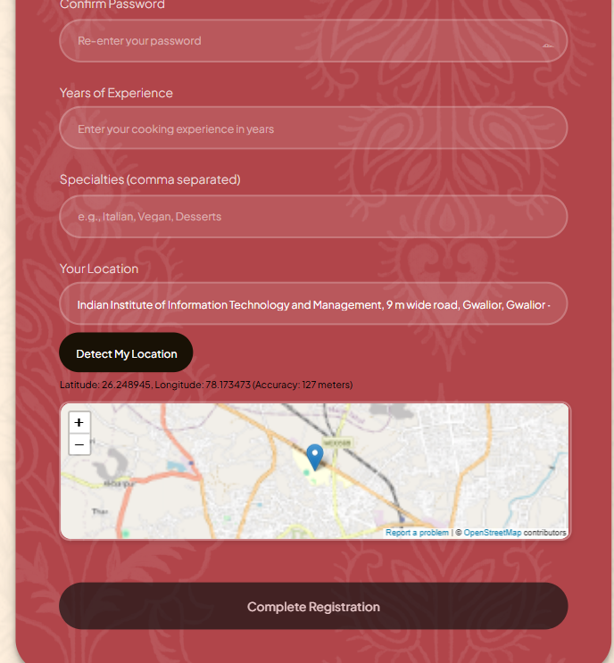
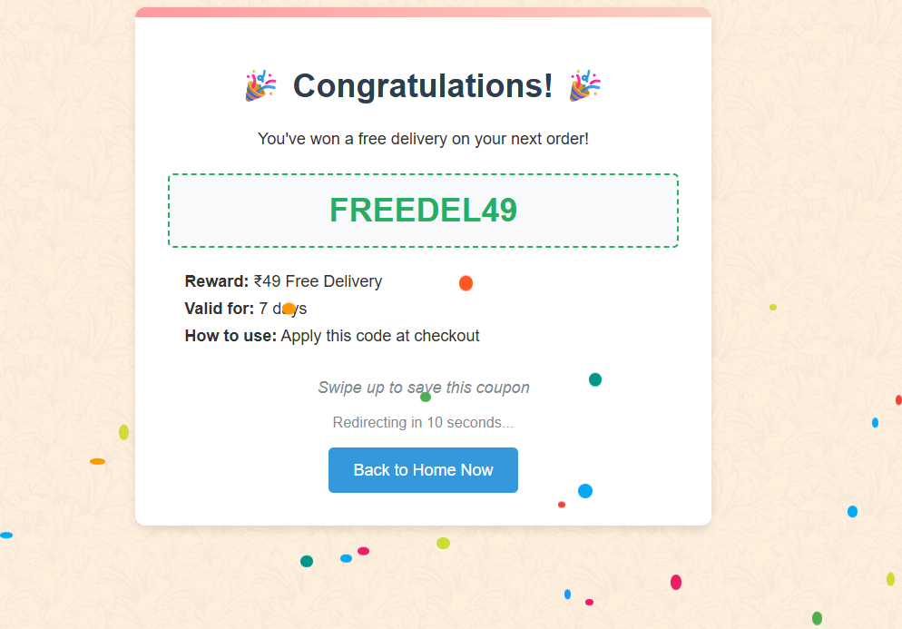

# Gharvedtan

A trust-based, hyperlocal platform connecting home-cooked meal providers, 
delivery partners, and everyday users to deliver not just food, but care, 
connection, and small daily needs. It empowers local home cooks, supports 
affordability, and builds community through empathy-driven design. Buyers can 
order nearby home meals, add extra items like groceries or books, and enjoy a 
social layer with chats, group orders, and gamified rewards. Verified delivery 
partners are rated on helpfulness and incentivized for multi-tasking. The platform 
fosters dignity, reduces food waste, fights loneliness, and creates 
micro-jobs—making every delivery a step toward a kinder, more connected 
neighborhood.


##  Pages

<p align="center">
  
  
  
  
  
  
</p>


---
## Hosted URL 
Frontend: https://yourprojectname.vercel.app   
Backend API: https://yourprojectname.onrender.com


## Features Implemented 
### **Frontend**
Responsive Design – Works seamlessly on desktop
 Browse Local Cuisines – Discover diverse home-cooked meals
 Search & Filter – Find dishes by cuisine, or location
 Add to Cart – Easy ordering system for multiple dishes
 Location-Based Recommendations – Meals from chefs near you
 Smooth Animations – For an engaging browsing experience
### **Backend** 
The backend will handle user and seller authentication (role-based signup/login, 
session or token management,  and optionally (Auth/Firebase Auth), store and 
serve catalog data (items, categories, seller profiles), support seller CRUD for 
adding/updating/removing menu items (images, prices, stock, availability), power 
a *fast search API* with location-aware filtering and text/indexed search, manage 
buyer carts and persistent order checkout flows (order state transitions, price 
calculation, tax/discounts), provide order management for sellers 
(accept/prepare/dispatch), and drive the delivery experience (real-time order 
tracking, ETA updates, notifications). It will also auto-detect user location 
(geolocation fallback → reverse geocoding), handle payments or payment 
intents, record analytics and logs, expose admin controls (user/seller moderation, 
content and payout reporting), and include security/operational concerns (rate 
limiting, input validation, secure file uploads, backups, monitoring). The *delivery 
“maze” mini-game* is integrated into order lifecycle endpoints so the frontend can 
launch and report game progress and award points or discounts tied to orders. 
- ***User authentication (phone/Google)***
 -***Menu browsing and search***
- ***Shopping cart functionality*** 
- ***Checkout and payment processing***
- ***A delivery game with rewards*** 
- ***Admin interface for adding menu items*** 

#### Core Technologies 
- HTML5 
- CSS3 
- JavaScript (ES6+) 
- Firebase (Backend-as-a-Service) 
- Firebase Authentication (Phone, Google) 
- Firestore Database (NoSQL) 
- Cloud Storage (for images) 
#### Frontend Libraries & Frameworks 
- Razorpay 
- Payment gateway integration (for checkout). 
- Cloudinary 
- Image upload, optimization, and CDN delivery. 
- Nominatim (OpenStreetMap API) 
- Reverse geocoding for location detection. 
#### Firebase Modules Used 
- javascript 
- getAuth  
- RecaptchaVerifier
- signInWithPhoneNumber  
- GoogleAuthProvider  
- signInWithPopup 
- onAuthStateChanged  

 
-  getFirestore  
- doc  
- setDoc  
- getDoc
- updateDoc  
- collection  
- query  
- where 
- getDocs
- arrayUnion  
- arrayRemove

#### UI & Styling 
- CSS Animations & Keyframes 
Used for transitions (e.g., coupon fade-in, confetti effects). 
- Flexbox & Grid Layout 
- Responsive Design  
#### Game Development (Delivery Game) 
- HTML5 Canvas 
- Maze rendering, player movement, and collision detection. 
- Custom Sprites & Assets 
- Audio API 
  
#### Utility & Helper Functions 
- Debounce 
- For search input optimization. 
- Session Storage 
- Storing user login state, rewards, and cart data. 
- Geolocation API 
- Detecting user location. 
#### External APIs & Services 
- Cloudinary for Image uploads 
(https://api.cloudinary.com/v1_1/dew4c5d4k/upload) 
- Reverse geocoding 
(https://nominatim.openstreetmap.org/reverse) 
- Razorpay for Payment processing (rzp_test_So0Z8L6zsfTX4h) 
#### Backend & Hosting 
- Firebase Hosting (Assumed, since Firebase is used) 
- Cloudinary (Image hosting & transformations) 

# Local Setup
```
***Clone the Repository***
- git clone https://github.com/yourusername/yourrepo.git 
- cd yourrepo
``` 
## Frontend Setup 
- cd frontend 
- npm install 
- Create .env file with your Firebase config: 
- REACT_APP_FIREBASE_API_KEY=your_api_key 
- REACT_APP_FIREBASE_AUTH_DOMAIN=your_auth_domain 
- REACT_APP_FIREBASE_PROJECT_ID=your_project_id 
- REACT_APP_FIREBASE_STORAGE_BUCKET=your_storage_bucket 
- REACT_APP_FIREBASE_MESSAGING_SENDER_ID=your_sender_id 
- REACT_APP_FIREBASE_APP_ID=your_app_id 
### ***Start frontend locally:*** 
- npm start 
## Backend Setup  
- cd ../backend 
- npm install 
- Create .env file with your backend environment variables: 
- MONGO_URI=your_mongodb_atlas_connection
- PORT=5000 
### Start backend locally: 
- npm run dev 
- Run the Project 
- *Backend: http://localhost:5000*
- *Frontend: http://localhost:3000*

### Team Members 
- ***Tanishqa Sharma***  
- ***Pund Vedshree Raju***
- ***Gargi Kalia*** 
### Demo Video 
Upload on drive of gharvedtan and then public video link share  
